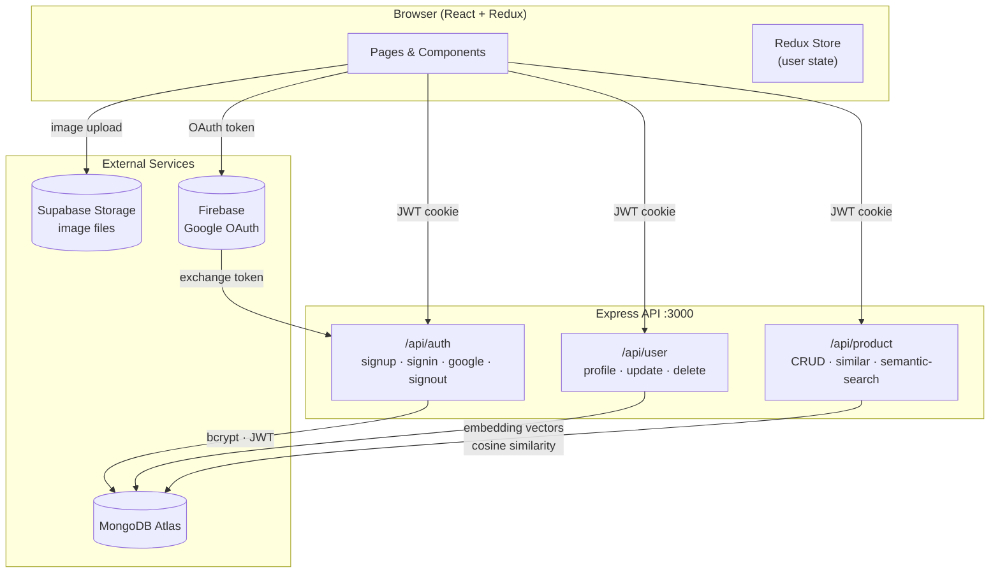

# Encore — Beauty Marketplace

> **Luxury looks at affordable prices.** Encore is a full-stack MERN marketplace for buying and selling pre-loved beauty products, complete with AI-powered semantic search and a "You Might Also Like" recommendation engine.

---

## Table of Contents

- [Overview](#overview)
- [Features](#features)
- [Tech Stack](#tech-stack)
- [Architecture](#architecture)
- [Project Structure](#project-structure)
- [Getting Started](#getting-started)
  - [Prerequisites](#prerequisites)
  - [Environment Variables](#environment-variables)
  - [Installation](#installation)
  - [Running Locally](#running-locally)
  - [Building for Production](#building-for-production)
- [API Reference](#api-reference)
- [Scripts](#scripts)
- [Contributing](#contributing)

---

## Overview

Encore lets users list pre-owned beauty products (makeup, skincare, haircare, fragrances, tools & accessories) and discover similar items through two search modes:

- **Keyword search** — filter by category, brand, condition, and price.
- **Semantic / Smart Search** — query by meaning using a 128-dimensional embedding model, so a search for *"moisturising face cream"* surfaces relevant listings even when the words don't match exactly.

Each product page also displays a **"You Might Also Like"** section powered by cosine-similarity comparisons against every other listing in the database.

---

## Features

| Feature | Details |
|---|---|
| 🔐 Authentication | Email/password sign-up and Google OAuth via Firebase |
| 📦 Product CRUD | Create, read, update, and delete your own listings |
| 🖼️ Image uploads | Multi-image upload stored in Supabase Storage |
| 🔍 Keyword search | Filter by category, brand, condition; sort by date or price |
| 🤖 Semantic search | Hash-based 128-dim embeddings + cosine similarity |
| 💡 Recommendations | "You Might Also Like" cards on every product page |
| 🛡️ Protected routes | JWT cookie auth guards listing management and profile |
| 📱 Responsive UI | Tailwind CSS, Swiper carousel, lucide-react icons |

---

## Tech Stack

**Frontend**
- React 18 + Vite
- Redux Toolkit + redux-persist (global auth state)
- React Router v6
- Tailwind CSS
- Swiper (image carousels)
- Firebase (Google OAuth)
- Supabase JS client (image uploads)

**Backend**
- Node.js + Express
- Mongoose / MongoDB Atlas
- JSON Web Tokens (JWT) stored in HTTP-only cookies
- bcryptjs (password hashing)
- dotenv, cookie-parser

---

## Architecture

The diagram below shows the main request paths through the system.



---

## Project Structure

```
mern-project/
├── api/                        # Express backend
│   ├── controllers/
│   │   ├── auth.controller.js  # signup, signin, Google OAuth, signout
│   │   ├── product.controller.js # CRUD + similar products + semantic search
│   │   └── user.controller.js  # profile update / delete
│   ├── models/
│   │   ├── user.model.js
│   │   └── product.model.js    # includes embedding[] field
│   ├── routes/
│   │   ├── auth.route.js
│   │   ├── product.route.js
│   │   └── user.route.js
│   ├── utils/
│   │   ├── embeddings.js       # generateEmbedding, cosineSimilarity
│   │   ├── verifyUser.js       # JWT middleware
│   │   └── error.js
│   └── index.js                # App entry point, serves client/dist in prod
│
├── client/                     # React + Vite frontend
│   ├── public/                 # Static assets (hero images)
│   ├── src/
│   │   ├── components/
│   │   │   ├── Header.jsx
│   │   │   ├── Footer.jsx
│   │   │   ├── ProductItem.jsx
│   │   │   ├── SimilarProducts.jsx
│   │   │   ├── OAuth.jsx
│   │   │   ├── Contact.jsx
│   │   │   └── PrivateRoute.jsx
│   │   ├── pages/
│   │   │   ├── Home.jsx
│   │   │   ├── Search.jsx
│   │   │   ├── Product.jsx
│   │   │   ├── CreateProduct.jsx
│   │   │   ├── UpdateProduct.jsx
│   │   │   ├── Profile.jsx
│   │   │   ├── SignIn.jsx
│   │   │   ├── SignUp.jsx
│   │   │   └── About.jsx
│   │   ├── redux/
│   │   │   ├── store.js
│   │   │   └── userSlice.js
│   │   ├── firebase.js
│   │   └── App.jsx
│   └── package.json
│
├── package.json                # Root scripts (dev · start · build)
└── .env                        # Environment variables (not committed)
```

---

## Getting Started

### Prerequisites

- **Node.js** ≥ 18
- **npm** ≥ 9
- A **MongoDB Atlas** cluster
- A **Supabase** project (for image storage)
- A **Firebase** project (for Google OAuth)

### Environment Variables

Create a `.env` file in the project root:

```env
# MongoDB
MONGO=mongodb+srv://<user>:<password>@cluster.mongodb.net/<dbname>?retryWrites=true&w=majority

# JWT
JWT_SECRET=your_jwt_secret_here
```

Create `client/.env` (or add `VITE_` prefixed vars to root .env if using Vite's env handling):

```env
VITE_FIREBASE_API_KEY=your_firebase_api_key
VITE_SUPABASE_URL=https://your-project.supabase.co
VITE_SUPABASE_ANON_KEY=your_supabase_anon_key
```

> **Never commit `.env` files.** Both are listed in `.gitignore`.

### Installation

```bash
# Install root (API) dependencies
npm install

# Install client dependencies
npm install --prefix client
```

### Running Locally

```bash
# Start the API server with hot-reload (port 3000)
npm run dev

# In a separate terminal — start the Vite dev server (port 5173)
npm run dev --prefix client
```

The API proxies are configured in `client/vite.config.js`, so `/api/*` requests from the frontend are forwarded to `localhost:3000` automatically.

### Building for Production

```bash
npm run build
```

This installs all dependencies and compiles the React app into `client/dist`. The Express server then serves those static files directly, so a single process handles both API and UI.

---

## API Reference

### Auth — `/api/auth`

| Method | Path | Auth | Description |
|---|---|---|---|
| POST | `/signup` | — | Register with email + password |
| POST | `/signin` | — | Sign in, returns JWT cookie |
| POST | `/google` | — | Exchange Firebase Google token for JWT |
| GET | `/signout` | — | Clear JWT cookie |

### User — `/api/user`

| Method | Path | Auth | Description |
|---|---|---|---|
| POST | `/update/:id` | ✅ JWT | Update profile (username, avatar, password) |
| DELETE | `/delete/:id` | ✅ JWT | Delete account and all listings |
| GET | `/listings/:id` | ✅ JWT | Get all products listed by a user |
| GET | `/:id` | — | Get public user profile |

### Product — `/api/product`

| Method | Path | Auth | Description |
|---|---|---|---|
| POST | `/create` | ✅ JWT | Create listing (auto-generates embedding) |
| POST | `/update/:id` | ✅ JWT | Update listing (re-generates embedding) |
| DELETE | `/delete/:id` | ✅ JWT | Delete listing |
| GET | `/get/:id` | — | Get single product |
| GET | `/get` | — | Keyword search with filters (`searchTerm`, `category`, `brand`, `conditions`, `sort_order`, `limit`, `startIndex`) |
| GET | `/similar/:id` | — | Return top-N most similar products by cosine similarity |
| GET | `/semantic-search` | — | Semantic search by query string (`q`, `limit`) |

---

## Scripts

| Command | What it does |
|---|---|
| `npm run dev` | Start API with nodemon (hot-reload) |
| `npm start` | Start API without hot-reload |
| `npm run build` | Install deps + build React client into `client/dist` |
| `npm run dev --prefix client` | Start Vite dev server for the frontend |
| `npm run build --prefix client` | Build frontend only |
| `npm run lint --prefix client` | Run ESLint on the frontend source |

---

## Contributing

1. Fork the repository and create your branch from `main`.
2. Run `npm install` and `npm install --prefix client`.
3. Make your changes, following the existing code style.
4. Lint the frontend: `npm run lint --prefix client`.
5. Open a pull request describing your changes.
